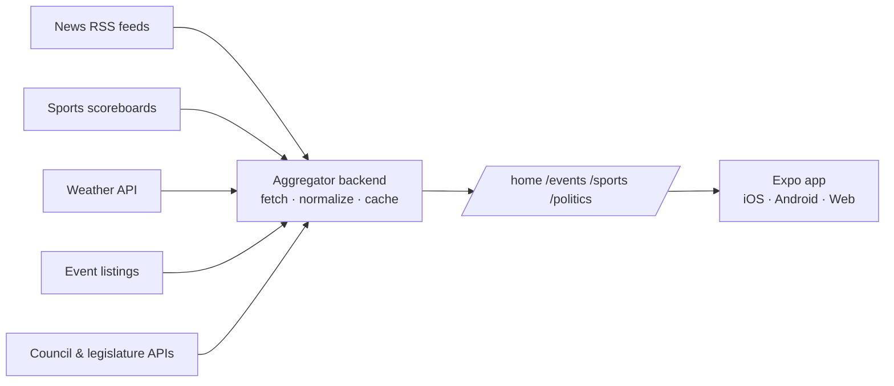

# PhillyPulse (working name)

**Everything happening in Philly today, in one place.**

Built for **OwlHacks 2026 — Philly Special track**.

---

## The Problem

Staying on top of what's happening in Philadelphia means checking a lot of places. Local news is spread across several outlets. Game times and scores live in separate team and league apps. Weather is its own app. Parades, races, and festivals, along with the street closures they bring, are listed on city pages, tourism sites, and ticketing platforms. Local government information sits on City Council's legislative portal, state legislature sites, and election office pages that most people never visit.

The result is that residents miss things that affect their day:

- **Getting caught off guard.** A half-marathon closes your usual route, or a parade shuts down Broad Street, and you find out when you're already stuck in it.
- **Missing the moment.** The Phillies are in a tight game or the Eagles kick off in an hour, and you didn't know until it was over.
- **Being left out of local decisions.** City Council hearings and local bills shape daily life in Philadelphia (housing, transit, taxes, public safety), but they get little attention, and election deadlines slip by unnoticed.
- **Newcomers have it hardest.** Students, new residents, and visitors don't yet know which sources to trust or where to look.

No single place answers the simple question: **"What's going on in Philly right now?"**

## The Solution

PhillyPulse is a mobile and web app that acts as **Philadelphia's daily dashboard**. It brings together local news, events, sports, weather, and civic information in one glanceable app with four tabs: **Home, Events, Sports, and Politics**.

Open it in the morning and within seconds you know the weather, which Philly teams play today, the top local headlines, and anything this week that might close your street or be worth showing up for.

### Guiding principles

- **Local first.** Everything is filtered for Philadelphia. No national noise.
- **Glanceable.** The Home screen answers "what do I need to know today?" in under 10 seconds. Detail lives one tap deeper.
- **Always fresh.** Data refreshes automatically: live scores every minute, weather every 30 minutes, news and events throughout the day.
- **Respect the source.** News items show headlines and short snippets, then link to the original outlet. We point readers to local journalism rather than replace it.
- **Civic, not partisan.** The Politics tab uses official sources and neutral plain-language summaries. No endorsements, no opinion content.

### Who it's for

- Philadelphia residents who want one app instead of five
- Students (Temple and beyond), including those new to the city
- Commuters who need to know about closures and big events
- Anyone who wants to follow local government without digging through official portals

---

## How It Works

The app never calls outside data sources directly. A lightweight backend collects data from news feeds, sports scoreboards, weather services, event listings, and government APIs on a schedule. It cleans and caches that data, then serves it to the app through four simple endpoints, one per tab.



This keeps the app fast, keeps API keys off users' devices, avoids browser CORS restrictions on the web version, and means one slow or failing source never breaks the whole app.

---

## MVP

### App shell
- [ ] Bottom tab navigation: Home, Events, Sports, Politics
- [ ] Pull-to-refresh on every screen
- [ ] Runs on iOS, Android, and web from one codebase

### Home
- [ ] Weather card: current conditions, today's high and low, 3-day outlook
- [ ] "Today in Philly" sports strip showing any Philly team playing today, with a pulsing **LIVE** badge for games in progress
- [ ] Top 5–8 local headlines from the last 24 hours, each linking to the original article
- [ ] "This week" preview of the next 3 upcoming events

### Events
- [ ] This week's events, grouped by day
- [ ] Filters: Parades & Festivals, Races & Runs, Civic/Political, Concerts & Shows
- [ ] Each event shows date, time, location, link, and any street-closure notes

### Sports
- [ ] Three views: **Live**, **Upcoming**, **Recent**
- [ ] Teams: Eagles, Phillies, Sixers, Flyers, Union, Temple Owls
- [ ] Live games show the score and game clock or inning, auto-refreshing while open
- [ ] "Where to watch" shows the official broadcaster and links to its app or site
- [ ] Recent games show final scores and a link to the recap

### Politics
- [ ] Upcoming election countdown with key dates (registration and mail-ballot deadlines) and a link to the official polling place lookup
- [ ] This week's City Council hearings and sessions
- [ ] Recently introduced or passed bills, each with a one-sentence plain-language summary and a link to the official text

### Out of scope for the MVP (stretch goals)
- Saved favorite teams
- Push notifications when a favorite team's game starts
- "Find your reps" lookup by address
- AI-generated "Philly in 60 seconds" daily digest
- User accounts

---

## Tech Stack

| Layer | Technology |
|---|---|
| Mobile & web app | React Native + Expo, TypeScript, Expo Router |
| Data fetching | TanStack Query (caching, auto-refresh) |
| Backend | Python + FastAPI |
| Scheduling | APScheduler (or cron via GitHub Actions / Cloud Scheduler) |
| Cache / storage | SQLite or Redis |
| Hosting | Backend container on Google Cloud Run or Render; web build on Netlify or Vercel |
| CI/CD | GitHub Actions: type-check, lint, test, build and deploy on push to `main` |

## Data Sources

| Section | Source |
|---|---|
| Weather | Open-Meteo / National Weather Service API |
| News | RSS feeds from Philadelphia news outlets |
| Sports | Public scoreboard data (schedules, live scores, broadcasters) |
| Events | Ticketmaster Discovery API plus a curated list of city events (parades, races, festivals) |
| Politics | Philadelphia City Council legislative data (Legistar), Open States (PA General Assembly), official election pages |

---

## Getting Started

### Backend
```bash
cd backend
python -m venv .venv && source .venv/bin/activate
pip install -r requirements.txt
cp .env.example .env   # add API keys
uvicorn main:app --reload
```

### App
```bash
cd app
npm install
npx expo start         # press w for web, or scan the QR code with Expo Go
```

---

## Team

- Name — role
- Name — role
- Name — role
